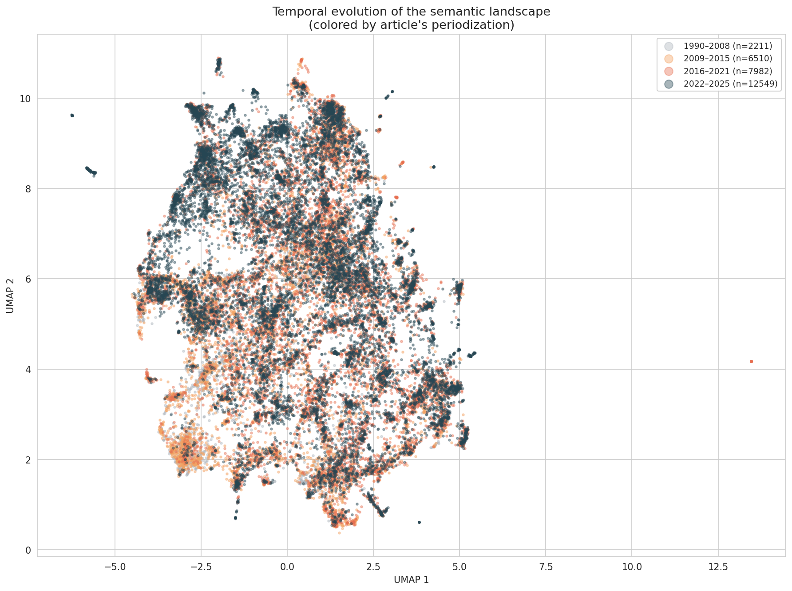
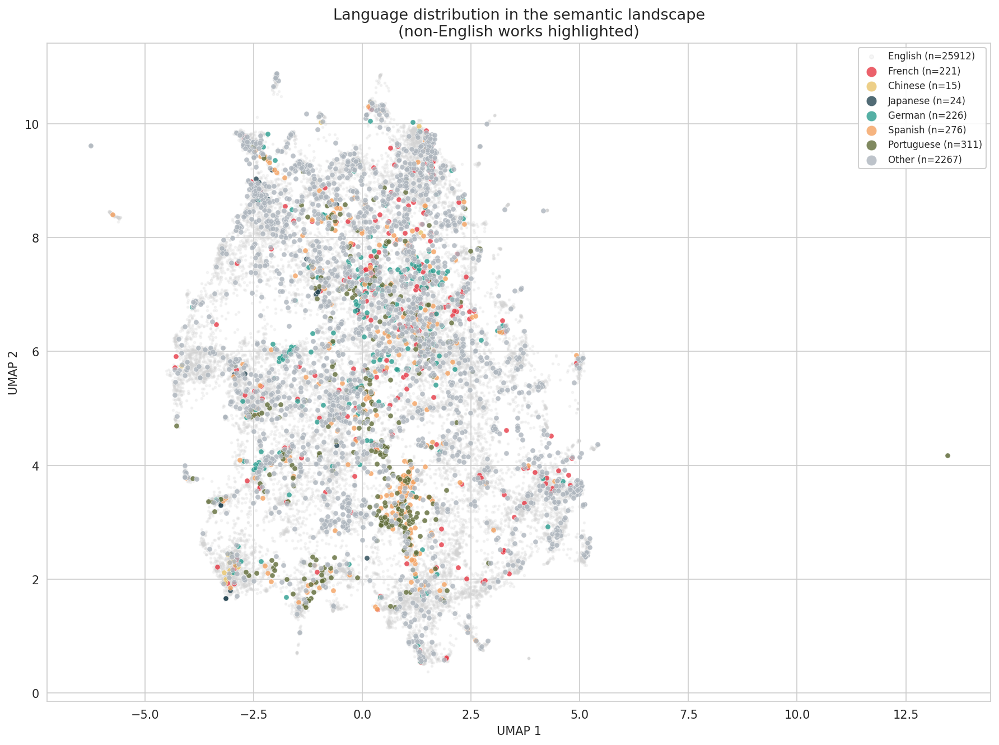

This document describes how the corpus of  works on climate finance was assembled from  sources, enriched, filtered, and validated. It is a companion to the code repository: the document a reviewer or replicator reads alongside the scripts, data, and configuration files. The corpus snapshot was taken on 2026-03-26; records first indexed after this date are excluded.

All scripts are in `scripts/`, generated data in `$CLIMATE_FINANCE_DATA/catalogs/`, and outputs in `content/figures/` and `content/tables/`.

The report follows the pipeline in order: Section 1 maps the full pipeline as a DAG; Section 2 traces each construction stage in detail; Section 3 reports quality checks on metadata, embeddings, and citations; Section 4 describes what the finished corpus contains.

# Pipeline Overview

The corpus building pipeline is managed by DVC (Data Version Control). The five discovery stages run independently; their outputs are merged into a single catalog, then enriched, refined, and aligned in a linear chain. Enrichment runs on the full `unified_works.csv` so that all metadata is available when the flagging rules are evaluated. The extend step computes six quality flags for every work without removing any rows; the filter step applies the retention policy and writes `refined_works.csv` together with `corpus_audit.csv`. The align step produces the Phase 2 canonical inputs (`refined_embeddings.npz`, `refined_citations.csv`) from full enrichment caches.

{#fig-dag width=100%}

\newpage

# Corpus Construction

The following sections trace each stage in depth: how sources were identified and merged, how metadata and embeddings were added, and how the filtering policy was applied.



---



---



\newpage

# Data Quality

With the corpus assembled, three independent checks verify that the retained records are accurate, semantically coherent, and citation-complete. The table below summarises per-source counts; the sections that follow assess metadata accuracy, embedding quality, and citation graph coverage in turn.



---



---



---



\newpage

# Corpus Contents

The  retained works span 1992 to 2024 and cover English, French, Chinese, Japanese, German, Spanish, and Portuguese scholarship. This section describes the corpus composition through four complementary views: annual volume, semantic geography, temporal layering, and language distribution.

Figure @fig-bars shows annual publication counts. The bar chart reflects the field's growth trajectory: sparse output before 2007, accelerating through the 2009--2015 crystallization period, and sustained high volume from 2016 onward.

{#fig-bars width=100%}

Figure @fig-semantic maps the corpus in two dimensions using UMAP dimensionality reduction applied to BGE-M3 embeddings of each work's title, abstract, and keywords. Each point is one work; the six colors correspond to the six KMeans clusters computed by `compute_clusters.py`. Proximity indicates semantic similarity: works that share vocabulary and concepts appear close together regardless of source or language. The clustering is unlabeled here — cluster labels are derived from TF-IDF distinctiveness and reported in the alluvial analysis.

{#fig-semantic width=100%}

Figure @fig-semantic-period repeats the same UMAP projection with points colored by publication period (1990–2008, 2009–2015, 2016–2021, 2022–2024). Early works (grey) concentrate in a few regions of the semantic space; later works (darker tones) spread more broadly, consistent with the field's diversification after the Paris Agreement.

{#fig-semantic-period width=100%}

Figure @fig-semantic-lang colors the same map by language. English (light grey) dominates and fills the full semantic space; non-English works appear as colored foreground points. French, Chinese, and Japanese works concentrate in specific regions, suggesting distinct national literatures with their own topical emphases rather than translations of the English mainstream.

{#fig-semantic-lang width=100%}



The corpus operates at two levels of analysis — a broad field and an influential core — whose definitions govern all downstream figures.



\newpage

# Software Environment

Section 4 described what the corpus contains; this section documents how to reproduce it. Runtimes, dependency versions, and cross-machine reproducibility guarantees are given below.



\newpage

# Annexes {.unnumbered}



---


