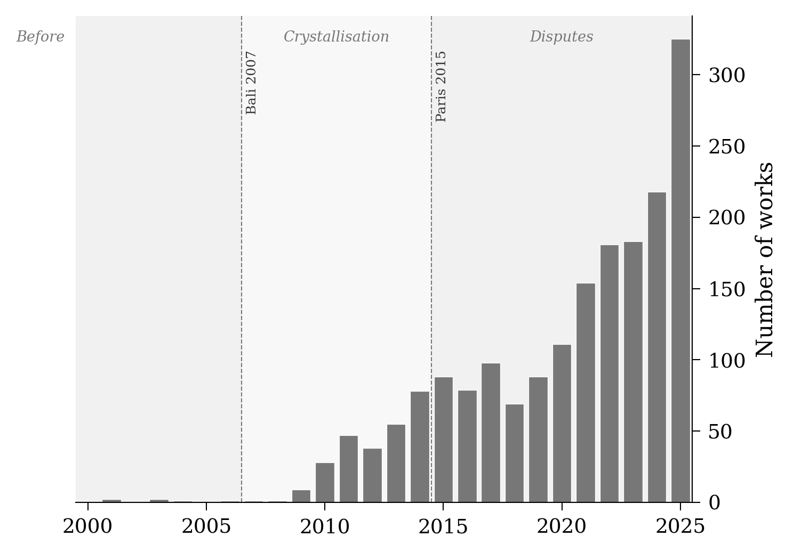

<!-- Target journal: Research Data Journal for the Humanities and Social Sciences (RDJ4HSS) -->
<!-- Format: Data Paper, max 2,500 words, diamond OA, IISG/Openjournals -->
<!-- Structure follows Petram & Kruizinga (2024) exemplar: Introduction, Method, Data, Concluding Remarks -->

- Related dataset: "A Multilingual Corpus of Climate Finance Literature, 1990--2024" with DOI [10.5281/zenodo.19097045](https://doi.org/10.5281/zenodo.19097045) in repository "Zenodo"

## 1. Introduction {#sec-introduction}

Climate finance---the financial flows directed at mitigating and adapting to climate change---has become one of the most politically salient objects in international economic governance. The \$100 billion annual commitment made at Copenhagen in 2009, and the \$300 billion New Collective Quantified Goal agreed at Baku in 2024, are contested not only in their adequacy but in their very definition: what counts as climate finance depends on accounting conventions that are themselves disputed [@roberts_weikmans2017; @michaelowa2007].

A growing scholarly literature addresses this contested object, spanning economics, political science, international relations, development studies, and environmental governance. Yet researchers approaching climate finance face a fragmented bibliographic landscape. Academic publications are scattered across databases with different coverage profiles. Institutional reports from the OECD, UNFCCC, World Bank, and Climate Policy Initiative---documents that have shaped the very categories of the debate---are absent from standard academic databases. And the literature is multilingual: while English dominates, French, Chinese, Japanese, and German traditions contribute perspectives that monolingual corpora miss entirely.

Recent bibliometric work has begun to map this literature. @care_weber2023 survey sustainable finance bibliometrics using Scopus; @shang_jin2023 analyse climate finance publications from Web of Science; @maria_etal2023 map green finance using Scopus with network analysis. While valuable, these studies rely on one database each, cover English-language publications only, and none publishes a reusable dataset. @shang_jin2023 contains no data availability statement despite the journal's mandatory policy. @maria_etal2023 mentions a GitHub repository with R scripts but provides no URL and no formal data availability statement. @care_weber2023 is behind an Elsevier paywall (CC-BY-NC-ND) with no publicly accessible dataset. We verified these claims by checking each paper's data availability section, the journal's data sharing policy, and public repositories (Zenodo, GitHub, Dataverse) for associated deposits.

Our dataset addresses these limitations by assembling a multilingual corpus from  complementary sources, applying a documented quality-filtering pipeline with full audit trail, and providing pre-computed sentence-transformer embeddings that place all works in a shared semantic space regardless of language. The dataset was constructed to support a history-of-economic-thought study of how climate finance crystallised as a category of economic governance [Ha-Duong, under review]. However, its scope and documentation make it reusable for a range of applications across the humanities and social sciences: topic modelling, citation network analysis, bibliometric mapping, temporal analysis of concept emergence, and cross-lingual studies of how climate finance is discussed in different linguistic and institutional traditions.

## 2. Method {#sec-method}

### 2.1 Sources {#sec-sources}

The corpus assembles academic and grey literature from  sources with complementary coverage profiles (@tbl-sources). Four are automated or semi-automated (reproducible from the scripts and an internet connection); two require manual export from restricted platforms.

| Source | Automation | Coverage |
|--------|------------|----------|
| OpenAlex | Automated (free API) | Primary academic source: tiered keyword search |
| ISTEX | Automated (public API) | French national archive (Springer, Elsevier, Wiley) |
| Grey literature | Hybrid (curated seed + World Bank API) | 16 curated reports (OECD, UNFCCC, CPI, UN) + World Bank repository |
| Teaching canon | AI-assisted (scraping + LLM extraction) | Syllabus readings from ~130 courses |
| bibCNRS | Hand-harvested (CNRS credentials) | Non-English literature (FR, ZH, JA) via WoS/EconLit |
| SciSpace | AI-collected, hand-exported | SciSpace systematic review tool exports |

: Sources, automation level, and coverage scope. {#tbl-sources}

The search strategy uses a four-tier keyword taxonomy reflecting the evolving vocabulary of climate finance. Tier 1 consists of core terms in eight languages (English, French, Chinese, Japanese, German, Spanish, Portuguese, Arabic). Tier 2 covers institutional and diplomatic vocabulary (e.g., "clean development mechanism," "green climate fund"). Tiers 3 and 4 broaden the search to climate-adjacent terms, requiring concept-group co-occurrence filters (2-of-4 and 3-of-4 respectively) to maintain precision. The taxonomy was informed by keyword mining of  core papers (cited $\geq$  times) and is defined in a version-controlled YAML configuration file.

The corpus is multilingual by design. While English dominates (%), the strategy explicitly targeted French (*finance climat*, *finance climatique*), Chinese, Japanese, and German through ISTEX, bibCNRS, and multilingual OpenAlex queries. This deliberate multilingual scope, though it yields a modest non-English share, provides a foundation for cross-linguistic studies that monolingual corpora cannot support.

All API queries are bounded to publication years 1990--2024. Raw API responses are stored in an append-only pool as compressed JSONL files, preserving complete responses for future re-extraction without re-downloading. The two hand-harvested sources (bibCNRS, SciSpace) together contribute approximately 900 works before deduplication, primarily filling gaps in non-English coverage. Their inclusion is validated by multi-source overlap: many of their records are independently confirmed by automated sources, confirming retrieval consistency.

### 2.2 Data Structure {#sec-data-structure}

The merge pipeline combines records from all sources through two deduplication passes: DOI-based (normalised, lowercased) and title+year matching for records lacking DOIs. When duplicates are found, the maximum citation count is retained and metadata follows a source-priority order. Boolean `from_*` columns (one per source) track which databases contributed each record, enabling provenance analysis. The `source_count` field records multi-source agreement: of the  refined works,  (%) appear in multiple sources.

A six-flag refinement pipeline then evaluates every work. Three flags require no external data: (1) missing metadata (no title), (2) absent abstract combined with an irrelevant title (lacking domain-specific terms in any of the target languages), and (3) title blacklist matches (noise terms such as "blockchain" or "deep learning" without climate-finance context). Three flags depend on enrichment outputs: (4) citation isolation (pre-2020 works neither cited by nor citing any other corpus work), (5) semantic outlier detection (embedding distance from corpus centroid exceeding mean + 2 standard deviations), and (6) cross-encoder relevance scoring against the query "climate policy and financial mechanisms."

Flagged works are removed unless protected by one of four conditions: citation count $\geq$ 50, presence in 2+ sources, within-corpus citations, or appearance in 2+ teaching syllabi. The teaching canon itself was constructed from two independent efforts: an automated scraper harvesting approximately 130 course syllabi (948 unique readings) and a manual catalog of readings from 15 specific syllabi (Harvard, NYU Stern, Stanford, and others). Every inclusion/exclusion decision is recorded in the audit trail.

### 2.3 Quality, Completeness, and Potential Biases {#sec-quality}

@tbl-qa summarises the corpus composition and metadata completeness per source, computed by `export_corpus_table.py`. The "Refined" column counts all works with a `from_*` flag for that source after deduplication and quality filtering; a single work may appear in multiple rows if discovered by several sources. %DOI is the share of works with a valid DOI. %Abstract is the share with an abstract longer than 50 characters. %Refs is the share with at least one reference in the citation graph (extracted via Crossref and OpenAlex). %OA is the share flagged as open access by OpenAlex.

| Source | Refined | %DOI | %Abstract | %Refs | %OA |
|-----------------|--------:|-----:|----------:|------:|----:|
| OpenAlex | 29,343 | 73% | 87% | 41% | 80% |
| ISTEX | 4 | 100% | 75% | 75% | 75% |
| bibCNRS | 222 | 11% | 5% | 1% | 4% |
| SciSpace | 608 | 82% | 90% | 48% | 38% |
| Grey literature | 183 | 97% | 97% | 2% | 22% |
| Teaching canon | 23 | 100% | 52% | 52% | 22% |
| **Total** | **29,878** | **72%** | **86%** | **41%** | **78%** |

: Per-source corpus quality metrics after deduplication and refinement. A work discovered by multiple sources appears in each source's count; the Total row is deduplicated. Generated by `export_corpus_table.py`. {#tbl-qa}

The merge pipeline reduces 41,162 raw records to  refined works (27.5% removal rate). Citation graph verification against Crossref on a stratified sample of 30 papers yielded precision = 1.0 and recall = 1.0. The citation network contains 722,727 rows covering 45% of corpus DOIs; coverage reaches 80% for core papers (cited $\geq$ 50).

Relevance filtering (flag 6) uses a cross-encoder reranker (BAAI/bge-reranker-v2-m3, 568M parameters) rather than a generative LLM, ensuring deterministic, reproducible classification without API costs. The model was calibrated in two stages. First, the best query was selected from 100 candidates evaluated on a stratified sample of 200 weak-labeled papers (100 positive, 100 negative), achieving AUC = 0.766. Second, human validation on a separate stratified sample of 100 works (20 per score quintile, blinded to scores) yielded AUC = 0.818 and 81% accuracy (precision 74%, recall 76%); an additional 100 boundary cases near the initial threshold were coded to refine the final cutoff. An independent LLM audit provides a second check. Both methods serve as independent checks on the flagging pipeline, not as ground truth, since what counts as "climate finance" is itself a contested category. All calibration and validation tables (weak labels, human-coded samples) are included in the Zenodo deposit.

Users should be aware of several potential biases. Non-English coverage remains limited (% English). Citation counts reflect OpenAlex data as of the collection date and favour older, English-language works. Grey literature records often lack abstracts (though 97% have them in this corpus). The teaching-canon component reflects a harvesting bias toward business schools that publish syllabi on public websites; development economics and international relations programmes tend to use institutional platforms that are not publicly accessible.

## 3. Data {#sec-data}

- Climate finance corpus --- DOI: [10.5281/zenodo.19097045](https://doi.org/10.5281/zenodo.19097045)
- Temporal coverage: 1990--2024

The dataset consists of five files deposited in Zenodo, also reproducible from source via the pipeline scripts.

**refined_works.csv** ( rows). The primary corpus file. Each row is one deduplicated work with columns for: identifier, DOI, title, first author, year, abstract, citation count, publication venue, work type, language code, source provenance flags (one boolean column per source: `from_openalex`, `from_istex`, `from_bibcnrs`, `from_scispsace`, `from_grey`, `from_teaching`), and quality-filtering metadata (`is_flagged`, `flag_reason`, `is_protected`). Of these,  core works (cited $\geq$  times) form the field's most-cited core. @fig-bars shows the temporal distribution.

**embeddings.npz.** Compressed NumPy archive containing L2-normalised -dimensional vectors for  works, computed by the multilingual sentence-transformer *paraphrase-multilingual-MiniLM-L12-v2*. The embedding count exceeds the refined corpus size because embeddings are computed before quality filtering (on all works with titles in the 1990--2024 range); the full cache is preserved to support alternative filtering strategies. Each work's embedded text concatenates title, abstract (if longer than 20 characters), and keywords. The model places texts in English, French, Chinese, Japanese, and German into a shared semantic space. Cross-lingual coherence was confirmed: non-English works cluster with thematically similar English-language works rather than forming language-specific clusters. The embeddings serve as direct input for BERTopic, top2vec, or other embedding-based topic models, avoiding the need to re-encode approximately  documents. The L2-normalised vectors also support cosine-similarity search for finding related works.

**corpus_audit.csv.** Complete audit trail: every work receives a decision (`kept`, `removed`, or `protected`) with reasons.

**citations.csv.** Internal citation network (722,727 rows) extracted via Crossref and OpenAlex enrichment. Each row records a (citing, cited) pair where both works belong to the corpus, enabling co-citation analysis, bibliographic coupling, and citation genealogy studies.

{#fig-bars width=100%}

The CC BY 4.0 licence applies to the dataset. All pipeline scripts are available in the project repository, organised in three phases: corpus building (API harvesting, merging, enrichment, and quality filtering), analysis (embedding projection, clustering, and derived statistics), and document rendering. The pipeline requires Python $\geq$ 3.10, managed with `uv` (dependency resolution from `pyproject.toml`), and uses DVC (Data Version Control) to track the pipeline DAG and ensure reproducibility. A `Makefile` provides convenience targets for each phase.

Reproducibility is ensured at several levels. API queries use fixed year bounds (1990--2024), and raw responses are archived for re-extraction. Deterministic outputs require `PYTHONHASHSEED=0` and `SOURCE_DATE_EPOCH=0` (set automatically by the Makefile). KMeans clustering outputs are rounded to bounded precision to absorb cross-platform BLAS differences. The four automated or hybrid-automated sources (OpenAlex, ISTEX, grey literature, teaching canon) can be re-harvested from the scripts with an internet connection. The two restricted sources (bibCNRS, SciSpace) have their raw exports included in the Zenodo deposit to ensure full reproducibility despite access restrictions.

## 4. Concluding Remarks {#sec-concluding}

This corpus addresses a gap in climate finance scholarship by providing a curated, multilingual, and reproducible bibliometric dataset spanning 35 years. Its -source design combines the breadth of OpenAlex with complementary coverage from French (ISTEX), non-English (bibCNRS), and institutional (grey literature) sources that are absent from single-database corpora. The pre-computed multilingual embeddings lower the barrier to semantic analysis, enabling researchers to study thematic structure, temporal evolution, and cross-lingual patterns without re-encoding the full corpus.

The dataset may contribute to several research directions. First, it supports quantitative studies of climate finance as a scholarly field---its growth trajectory, thematic structure, and institutional drivers---providing the empirical base for history-of-economics analyses of how this contested concept was co-produced by economists, policy institutions, and financial actors. Second, the provenance columns enable methodological studies of how different databases define the boundaries of "climate finance" differently, a question with implications for systematic review methodology in the social sciences. Third, the citation network enables genealogical analyses: tracing how foundational concepts (carbon markets, green bonds, adaptation finance) propagated through the literature and across disciplinary communities. Finally, the 35-year temporal span supports diachronic analyses of concept emergence and field structure dynamics, from the early UNFCCC negotiations through the post-Paris proliferation of green finance instruments.

The structure of the dataset invites scholars to supplement it with additional sources and perspectives. The provenance architecture---boolean flags per source, with a clear merge pipeline---makes it straightforward to add new databases or extend the temporal window while preserving backward compatibility with analyses performed on the current version.

## Acknowledgements {.unnumbered}

This work was supported by CNRS (Centre National de la Recherche Scientifique) and CIRED (Centre International de Recherche sur l'Environnement et le Développement). The OpenAlex Premium API was used for corpus construction. The author thanks the anonymous reviewers for their feedback.

## References {.unnumbered}
