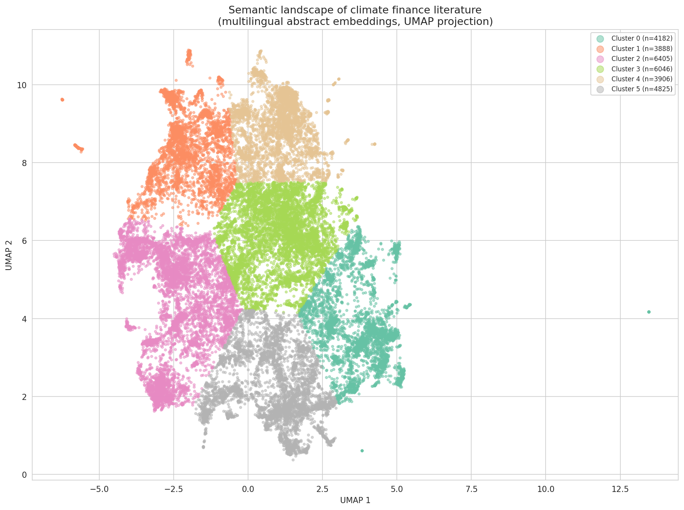

<!-- Target journal: Research Data Journal for the Humanities and Social Sciences (RDJ4HSS) -->
<!-- Format: Data Paper, max 2,500 words, diamond OA, IISG/Openjournals -->
<!-- Structure follows Petram & Kruizinga (2024) exemplar: Introduction, Method, Data, Concluding Remarks -->

- Related dataset: "A Multilingual Corpus of Climate Finance Literature, 1990--2024" with DOI [10.5281/zenodo.19097045](https://doi.org/10.5281/zenodo.19097045) in repository "Zenodo"

## 1. Introduction {#sec-introduction}

Climate finance---the financial flows directed at mitigating and adapting to climate change---has become one of the most politically salient objects in international economic governance. The \$100 billion annual commitment made at Copenhagen in 2009, and the \$300 billion New Collective Quantified Goal agreed at Baku in 2024, are contested not only in their adequacy but in their very definition: what counts as climate finance depends on accounting conventions that are themselves disputed [@roberts_weikmans2017; @michaelowa2007].

A growing scholarly literature addresses this contested object, spanning economics, political science, international relations, development studies, and environmental governance. Yet researchers approaching climate finance face a fragmented bibliographic landscape. Academic publications are scattered across databases with different coverage profiles. Institutional reports from the OECD, UNFCCC, World Bank, and Climate Policy Initiative---documents that have shaped the very categories of the debate---are absent from standard academic databases. And the literature is multilingual: while English dominates, French, Chinese, Japanese, and German traditions contribute perspectives that monolingual corpora miss entirely.

Recent bibliometric work has begun to map this literature [@care_weber2023; @shang_jin2023; @nalimov_miskiewicz2023], but existing datasets are either narrowly scoped (single database, English only) or lack the curation and documentation needed for reproducible analysis. Our dataset addresses these limitations by assembling a multilingual corpus from  complementary sources, applying a documented quality-filtering pipeline, and providing pre-computed sentence-transformer embeddings that place all works in a shared semantic space regardless of language.

The dataset was constructed to support the historical analysis presented in a companion study [Ha-Duong, under review], but its scope and documentation make it suitable for a range of research applications: topic modelling, citation network analysis, bibliometric mapping of the climate finance field, and cross-lingual studies of how climate finance is discussed in different linguistic traditions.

## 2. Method {#sec-method}

### 2.1 Sources {#sec-sources}

The corpus assembles academic and grey literature from  sources with complementary coverage profiles. Four are fully automated or hybrid-automated; two require manual export from restricted platforms.

| Source | Automation | Coverage |
|--------|------------|----------|
| OpenAlex | Automated (free API) | Primary academic source: tiered keyword search |
| Semantic Scholar | Automated (free API) | arXiv preprints, dissertations, working papers |
| ISTEX | Automated (public API) | French national archive (Springer, Elsevier, Wiley) |
| Grey literature | Hybrid (YAML seed + World Bank API) | OECD, UNFCCC, World Bank, CPI reports |
| Teaching canon | Automated (YAML extraction) | Syllabus readings from 15 institutions |
| bibCNRS | Hand-harvested (CNRS credentials) | Non-English literature (FR, ZH, JA) via WoS/EconLit |
| SciSpace | Hand-harvested (commercial tool) | AI-curated thematic corpus |

: Sources, automation level, and coverage scope. {#tbl-sources}

The search strategy uses a four-tier keyword taxonomy reflecting the evolving vocabulary of climate finance. Tier 1 consists of core terms in eight languages (English, French, Chinese, Japanese, German, Spanish, Portuguese, Arabic). Tier 2 covers institutional and diplomatic vocabulary (e.g., "clean development mechanism," "green climate fund"). Tiers 3 and 4 broaden the search to climate-adjacent terms, requiring concept-group co-occurrence filters (2-of-4 and 3-of-4 respectively) to maintain precision. The taxonomy was informed by keyword mining of  core papers (cited $\geq$  times) and is defined in a version-controlled YAML configuration file.

The corpus is multilingual by design. While English dominates (%), the strategy explicitly targeted French (*finance climat*, *finance climatique*), Chinese (气候融资, 气候金融), Japanese (気候金融, グリーンファイナンス), and German through ISTEX, bibCNRS, and multilingual OpenAlex queries.

### 2.2 Data Structure {#sec-data-structure}

The merge pipeline combines records from all sources through two deduplication passes: DOI-based (normalised, lowercased) and title+year matching for records lacking DOIs. When duplicates are found, the maximum citation count is retained and metadata follows a source-priority order. Boolean `from_*` columns (one per source) track which databases contributed each record, enabling provenance analysis. The `source_count` field records multi-source agreement: of the  refined works,  (%) appear in multiple sources.

A six-flag refinement pipeline then evaluates every work: missing metadata, absent abstract with irrelevant title, title blacklist (noise terms), citation isolation (pre-2020 works with no citations), semantic outlier detection (embedding distance from corpus centroid), and cross-encoder relevance scoring. Flagged works are removed unless protected by high citation count ($\geq$ 50), multi-source agreement, within-corpus citations, or teaching-canon presence. Every decision is recorded in a full audit trail (`corpus_audit.csv`).

### 2.3 Quality, Completeness, and Potential Biases {#sec-quality}

Relevance filtering uses a cross-encoder reranker (BAAI/bge-reranker-v2-m3, 568M parameters) calibrated on weak labels derived from independent corpus signals (teaching syllabi, high-citation works, multi-source overlap). The best query achieved AUC = 0.766 on weak labels. Human validation on a stratified sample of 100 works yielded AUC = 0.818 and 81% accuracy (precision 74%, recall 76%). An independent LLM audit provides a second check. Both serve as independent checks on the flagging pipeline, not as ground truth, since relevance to "climate finance" is itself a contested category.

Potential biases include: non-English coverage, while deliberate, remains limited; citation counts reflect OpenAlex data as of the collection date and favour older, English-language works; grey literature records often lack abstracts; and the teaching-canon convergence reflects business-school syllabi more than development-economics or international-relations courses. Two sources require institutional credentials for re-collection (bibCNRS, SciSpace); their raw exports are included in the Zenodo deposit.

## 3. Data {#sec-data}

- Climate finance corpus --- DOI: [10.5281/zenodo.19097045](https://doi.org/10.5281/zenodo.19097045)
- Temporal coverage: 1990--2024

The dataset consists of five files deposited in Zenodo, also reproducible from source via the pipeline scripts.

**refined_works.csv** ( rows). The primary corpus file. Each row is one deduplicated work with columns for: identifier, DOI, title, first author, year, abstract, citation count, publication venue, work type, language code, source provenance flags (`from_openalex`, `from_istex`, `from_bibcnrs`, `from_scispsace`, `from_grey`, `from_teaching`), and quality-filtering metadata (`is_flagged`, `flag_reason`, `is_protected`). @fig-bars shows the temporal distribution.

**embeddings.npz.** Compressed NumPy archive containing L2-normalised -dimensional vectors from the multilingual sentence-transformer `paraphrase-multilingual-MiniLM-L12-v2`. Each work's embedded text concatenates title, abstract, and keywords. The model places texts in English, French, Chinese, Japanese, and German into a shared semantic space. Cross-lingual coherence was confirmed: non-English works cluster with thematically similar English-language works rather than forming language-specific clusters (@fig-semantic).

**corpus_audit.csv.** Complete audit trail: every work receives a decision (`kept`, `removed`, or `protected`) with reasons.

**semantic_clusters.csv.** KMeans cluster assignments (k=6) with UMAP 2D coordinates for all embedded works.

**citations.csv.** Internal citation network extracted via Crossref and OpenAlex enrichment.

{#fig-semantic width=100%}

{#fig-bars width=100%}

The CC BY 4.0 licence applies to the dataset. All pipeline scripts are available in the project repository, organised in three phases: corpus building, analysis, and document rendering. The pipeline requires Python $\geq$ 3.10, managed with `uv`, and uses DVC (Data Version Control) for pipeline reproducibility. All other sources (OpenAlex, ISTEX, grey literature, teaching canon) can be re-harvested from the scripts.

## 4. Concluding Remarks {#sec-concluding}

This corpus addresses a gap in climate finance scholarship by providing a curated, multilingual, and reproducible bibliometric dataset spanning 34 years. Its -source design combines the breadth of OpenAlex with complementary coverage from French (ISTEX), non-English (bibCNRS), and institutional (grey literature) sources that are absent from single-database corpora. The pre-computed multilingual embeddings lower the barrier to semantic analysis, enabling researchers to study thematic structure, temporal evolution, and cross-lingual patterns without re-encoding the full corpus.

The dataset may contribute to several research directions. It supports quantitative studies of climate finance as a scholarly field---its growth, thematic structure, and institutional drivers. The provenance columns enable methodological studies of how different databases define the boundaries of "climate finance" differently, a question with implications for systematic review methodology in the social sciences. And the 34-year temporal span supports diachronic analyses of concept emergence and field structure dynamics, from the early UNFCCC negotiations through the post-Paris proliferation of green finance instruments.

## Acknowledgements {.unnumbered}

This work was supported by CNRS (Centre National de la Recherche Scientifique) and CIRED (Centre International de Recherche sur l'Environnement et le Développement). The OpenAlex Premium API was used for corpus construction. The author thanks the anonymous reviewers for their feedback.

## References {.unnumbered}
