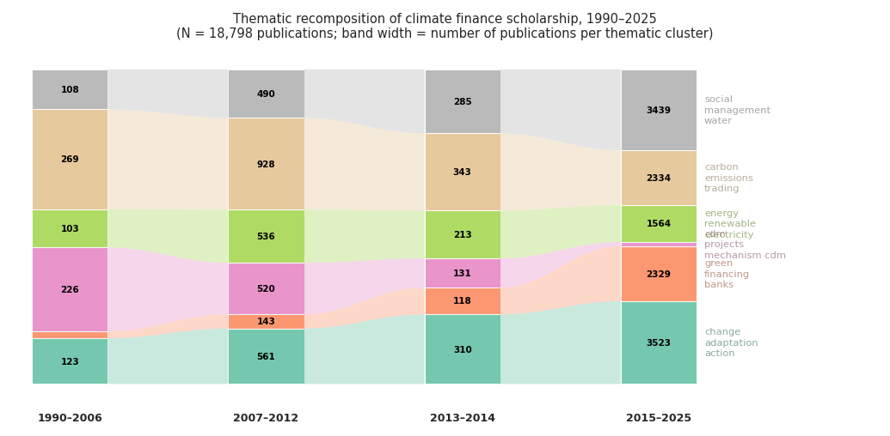

For over three decades, diplomats, economists, and civil-society advocates have argued about the adequacy of hundreds of billions of dollars that no single institution holds, disburses, or even defines in the same way. There is no United Nations climate bank. The Bretton Woods institutions have no mandate to settle the climate debt that developing countries claim from industrialised ones. The sums invoked at successive COPs---$100 billion per year pledged at Copenhagen in 2009, $300 billion agreed at Baku in 2024---are not balances in an account but aggregates assembled after the fact from heterogeneous flows, using conventions that are themselves the object of bitter dispute. How did something so consequential come to rest on categories so contested? Climate finance had to be *made* into a countable object before anyone could argue about whether enough of it existed. This paper asks how economists performed that making.

This paper offers a history-of-economic-thought analysis of the emergence of climate finance as a distinct economic object from the early 1990s to the mid-2020s (Figure 1). It examines how economists actively shaped the categories, metrics, and boundaries through which climate-related financial flows were defined, stabilised, and contested, contributing to the history of climate economics by shifting attention from models to accounting conventions.

The existing historiography of climate economics has focused primarily on modelling. @pottier2016 provides a critical intellectual history of the cost-benefit tradition from Nordhaus to the Stern Review, showing how the framing of climate change as an optimisation problem marginalised alternative approaches. @aykut_dahan2015 trace the co-production of climate science and international governance, emphasising how models became political instruments. More broadly, intellectual histories of environmental economics have traced the lineage from Pigou through Coase to cap-and-trade, emphasising the construction of pricing instruments. The parallel construction of *accounting* instruments for tracking financial flows has received no comparable historiographical attention. These works illuminate how economists framed climate change as a *problem*; they say little about how economists made climate finance into a *measurable object*. The shift from "what should the carbon price be?" to "how do we count the $100 billion?" involves a different kind of economic work---not modelling but accounting, not optimisation but commensuration [@espeland_stevens1998]. A growing political economy literature documents the power asymmetries and distributional conflicts embedded in climate finance accounting [@roberts_weikmans2017; @skovgaard2017]. These works reveal *what is at stake* in measurement disputes but treat the accounting categories themselves as given. We ask the prior question: how were these categories constructed, by whom, and through what intellectual operations? Our contribution addresses this gap: the intellectual history of the accounting conventions and measurement disputes through which climate finance was constituted as a governable economic domain.

Rather than treating climate finance as a technical extension of environmental or development economics, we situate it within a longer trajectory of climate economics. Early work on externalities and collective environmental constraints [@ayres_kneese1969] preceded, and only partially informed, later modelling efforts centred on growth, damages, and risk [@nordhaus1992; @manne_richels1992; @stern2007; @weitzman2007]. The burden-sharing dimension embedded in these models [Negishi weights; @negishi1960] remained disconnected from parallel debates on aid and international responsibility. Climate finance emerged through entanglement with international negotiations, development finance practices, and attempts to translate climate commitments into financially actionable terms---rather than as a direct outgrowth of integrated assessment modelling.

At this juncture, economists in international organisations played a decisive role. At the OECD, figures such as Jan Corfee-Morlot built statistical infrastructures---notably the Rio markers---that rendered climate finance measurable within development finance frameworks, defining what could legitimately count and how responsibility could be claimed [@corfee-morlot2009; @corfee-morlot2012]. These accounting categories became focal points of a deeper divide. On one side, economists working within a market-failure framework emphasised efficiency, leverage, and capital mobilisation, framing public climate finance as a catalytic instrument to crowd in private investment [@stern2009]. On the other, political-economy-oriented economists challenged both measurement conventions and normative assumptions: @michaelowa2007 on incentive-driven over-reporting, @roberts_weikmans2017 [see also @roberts2021] on accounting disputes as distributive conflicts, @kaul2003 [see also @kaul2017] on the distinct financing requirements of global public goods. We trace this divide through four recurrent controversies: the valuation of concessional loans, the credibility of Rio markers, the attribution of mobilised private finance, and the boundary between development assistance and climate-specific obligations.

The paper is organised into three historical acts. Section 1 traces the intellectual prehistory before climate finance existed as an autonomous object (1990--2006). Section 2 analyses the crystallization triggered by the Copenhagen commitment and the construction of OECD statistical infrastructure (2007--2014). Section 3 shows that all subsequent disputes---the $100 billion accounting battles, the $300 billion NCQG at Baku---have been fought within the stable categories established during crystallization (2015--2025). Section 4 synthesises the theoretical implications, drawing on the sociology of quantification [@desrosieres1998; @porter1995], performativity [@callon1998; @mackenzie2006], and economization [@caliskan_callon2009] to argue that climate finance was made governable precisely because economists turned it into an economic object.

We ground this historical argument in a computational analysis of approximately 22,000 works on climate finance (1990--2025), drawn from seven bibliographic sources including OpenAlex, ISTEX, and curated grey literature (OECD, World Bank, UNFCCC reports). Using sentence-transformer embeddings and sliding-window divergence tests, we detect structural breaks endogenously---driven by the data rather than imposed from COP milestones. The corpus analysis is exploratory evidence supporting the historical interpretation, not the reverse. The periodization and argument are grounded in the institutional record---primary sources, policy documents, and the intellectual trajectories of named actors. The computational patterns serve as corroborative signals that discipline the narrative, not as proof from which history is deduced. Each of the three historical sections closes with a "corpus evidence" subsection presenting the relevant quantitative findings; these subsections can be read together as a self-contained empirical companion or skipped without loss of the historical argument.

## 1. Before Climate Finance (1990–2006)

Climate finance did not exist as an autonomous economic object before the late 2000s. The term appears sporadically in the literature of the 1990s and early 2000s, but it referred to no stable category. What existed instead were three distinct intellectual traditions, each of which would later contribute elements to the concept without any of them producing it on their own.

### 1.1 Environmental economics and the externality framework

The first tradition is environmental economics, rooted in the treatment of pollution as an externality. From Pigou's welfare economics onward, the core analytical move was to identify divergences between private and social costs and to design corrective instruments (taxes, subsidies, tradable permits). @ayres_kneese1969 extended this framework to "materials balance," treating environmental degradation as a systemic by-product of production and consumption rather than an isolated market failure. The subsequent debate between Pigouvian taxation and Coasean bargaining generated a rich literature on instrument design, culminating in the cap-and-trade systems of the 1990 US Clean Air Act and, later, the EU Emissions Trading System. But this tradition did not produce a concept of climate *finance*. Its central question was the *price* of emissions (what should a carbon tax be?), not the *flow* of money between countries to address climate change. Even when the tradable-permits approach was internationalised through the Kyoto Protocol's flexible mechanisms, the focus remained on efficiency gains from trade, not on the transfer of financial resources as such.

When climate economics emerged as a distinct subfield in the late 1980s and 1990s, it inherited this orientation. The integrated assessment models developed by @nordhaus1992 and @manne_richels1992 framed climate change as an intertemporal optimisation problem: how much should the present generation invest in mitigation to reduce future damages? These models calculated optimal abatement paths and shadow prices of carbon, but they operated at a level of abstraction that left the institutional mechanisms of financing unspecified. Money flowed between "regions" in the models, but these flows were artefacts of welfare optimisation, not representations of actual financial instruments or aid commitments.

The Stern Review [@stern2007] marked a turning point in public visibility but not in conceptual architecture. Stern's argument that the benefits of early action outweighed the costs depended on a low discount rate---a choice contested by @weitzman2007 [see also @weitzman2009] and others---but the *kind* of action Stern envisaged was still framed in terms of carbon pricing and public investment, not in terms of a distinct "climate finance" category requiring its own accounting infrastructure. The famous "1% of GDP" figure was an aggregate cost estimate, not a financial flow from North to South.

### 1.2 Development economics and the categories of aid

The second tradition is development economics, which contributed the institutional categories through which climate finance would eventually be counted. The OECD's Development Assistance Committee had been tracking Official Development Assistance (ODA) since the 1960s, building an elaborate statistical system for classifying financial flows by type (grants, loans, equity), channel (bilateral, multilateral), sector, and purpose. This system embodied specific conceptual commitments: the distinction between "concessional" and "non-concessional" flows, the requirement that ODA have a "grant element" of at least 25%, the counting of face value rather than subsidy content. These were not natural categories but historical constructs, stabilised through decades of negotiation among donor countries and crystallised in the DAC statistical directives. As @desrosieres1998 argues, such statistical conventions acquire the force of objectivity once their conventional origins are forgotten.

The DAC system also encoded a particular geography of responsibility: aid flowed from North to South, measured by donor effort rather than recipient need. The 0.7% of GNI target, adopted by the UN General Assembly in 1970, established the metric through which donor generosity would be judged. This framework---bilateral flows, concessionality thresholds, donor-centred accounting---would later be grafted onto climate finance almost unchanged, importing both its analytical power and its political biases.

These categories were designed for development aid, not for climate policy. But when the need arose to count climate finance after Copenhagen, they provided the readymade infrastructure. The Rio markers, introduced in 1998 to tag aid projects targeting the objectives of the Rio Earth Summit conventions (climate, biodiversity, desertification), were the crucial link. They allowed development finance statisticians to retrofit climate labels onto existing aid data without building a new reporting system from scratch. This was efficient but consequential: it meant that the way climate finance was counted would reflect the assumptions, compromises, and blind spots of the ODA system [@michaelowa2007]. The markers were self-assessed by donors with no external verification---a design choice that would later become the subject of fierce controversy over inflation and credibility.

### 1.3 Burden-sharing and the disconnection from finance

The third tradition is the economics of burden-sharing in international environmental agreements. Models incorporating Negishi welfare weights [@negishi1960] had been used since the 1970s to analyse how the costs of collective action should be distributed among countries with different income levels. The climate negotiations of the 1990s---the Framework Convention (1992), the Kyoto Protocol (1997)---were deeply shaped by this logic: differentiated responsibilities, equity principles, historical emissions. Article 4.3 of the UNFCCC required developed countries to provide "new and additional financial resources" to developing countries, establishing the principle that would later generate the most intractable accounting dispute. Yet the burden-sharing literature remained disconnected from the practical questions of financial flows. It addressed the question "who should pay?" at a theoretical level but did not engage with the operational question "how do we count what has been paid?" The economic models that informed the negotiations treated transfers between regions as welfare-theoretic constructs, not as real-world financial flows requiring institutional tracking.

The Kyoto Protocol's Clean Development Mechanism (CDM) came closest to bridging this gap. By allowing developed countries to meet emission targets through projects in developing countries, the CDM created actual financial flows tied to climate objectives. A substantial literature emerged around CDM project design, additionality criteria, and carbon credit markets [@michaelowa2019]. The CDM was economically significant---by 2012, over 7,500 projects had been registered in 107 developing countries, generating billions of dollars in investment. It also introduced the concept of "additionality" as a practical test: would the project have happened without the CDM incentive? This concept would later migrate into climate finance debates, where it was repurposed to ask whether finance was "additional" to existing aid.

But the CDM operated through market mechanisms, not through budgetary transfers, and its financial flows were counted in terms of Certified Emission Reductions (CERs) rather than dollars of "climate finance." The CDM produced a vocabulary of carbon accounting, not of financial accounting. Moreover, the CDM's collapse after 2012---when CER prices fell below €1 as demand evaporated---demonstrated the fragility of market-based transfer mechanisms and reinforced the demand for a more robust, budget-based accounting of climate finance.

### 1.4 Why climate finance did not yet exist

The three traditions described above (environmental economics, development economics, and burden-sharing analysis) each addressed aspects of what would later be called climate finance. Environmental economists modelled the costs of climate action; development economists built the statistical infrastructure for tracking aid flows; burden-sharing analysts debated who should bear the costs. But none of them constituted climate finance as a *distinct economic object*---a category with its own metrics, its own institutions, and its own controversies.

In retrospect, these three traditions had remarkably little contact before the late 2000s. The integrated assessment modellers rarely engaged with the ODA literature; the DAC statisticians had no reason to attend to welfare economics debates about discount rates; the burden-sharing theorists operated at a level of abstraction that made the institutional details of aid delivery invisible. Climate finance as a concept required precisely the *intersection* of these traditions---the moment when a political commitment (burden-sharing), a measurement infrastructure (development economics), and a market-failure logic (environmental economics) were simultaneously demanded. That moment was Copenhagen, and the assembly it triggered is the subject of the next section.

### 1.5 Corpus evidence

The computational analysis corroborates this picture of disconnection. Figure 1 shows that climate finance scholarship within economics was negligible before 2007: fewer than 50 works per year, a fraction of a percent of the discipline's output. The literature that did exist was dispersed across the three traditions described above, with little cross-citation. The alluvial diagram (Figure 2) confirms the pattern: in the first period (1990--2006), the CDM/Kyoto cluster dominates, while the thematic communities that would later characterise the field---green finance, climate action, social dimensions---are small or absent. The CDM cluster's sharp contraction between the first and second periods traces the collapse of the carbon market vocabulary and its replacement by the financial accounting lexicon that crystallised after Copenhagen.

## 2. Crystallization (2007–2014)

### 2.1 The Copenhagen moment

The period beginning around 2007 marks a turning point. The Bali Action Plan (COP13, December 2007) established a mandate for "measurable, reportable and verifiable" (MRV) financial commitments---the first explicit demand that climate finance be rendered *countable* as a condition of political legitimacy. The Stern Review, published the year before, had already reframed climate change from an environmental externality into a financial risk of historic proportions [@stern2007]. Together, these interventions created the conditions for a new kind of economic object: one that required not just models but accounting infrastructure.

The decisive moment came at Copenhagen (COP15) in December 2009, when developed countries committed to mobilising $100 billion per year in climate finance by 2020. The commitment was, in the language of performativity theory, a speech act that called into being the very object it promised to deliver [@callon1998; @mackenzie2006]. Before Copenhagen, "climate finance" referred loosely to various financial flows related to climate policy---carbon market revenues, GEF grants, bilateral aid tagged with environmental objectives. After Copenhagen, it became a specific, politically binding quantity that had to be defined, measured, tracked, and reported. The $100 billion figure was not derived from any economic model or needs assessment; it emerged from last-minute diplomatic bargaining. Yet precisely because it was arbitrary, it *required* economists to build the measurement apparatus that would give it substance.

### 2.2 Building statistical infrastructure

The economists who stepped into this role were not academic theorists but policy professionals embedded in international organisations. The most consequential infrastructure was already under construction before Copenhagen. At the OECD's Development Assistance Committee (DAC), a system of "Rio markers" had been introduced in 1998 to flag aid projects with climate-relevant objectives. Originally a simple binary tag, the markers were redesigned in the mid-2000s into a three-tier system (principal, significant, not targeted) that became the *de facto* standard for counting bilateral climate finance. Jan Corfee-Morlot, an economist at the OECD's Environment Directorate, played a central role in connecting climate policy analysis with development finance statistics, co-authoring a series of working papers that established the conceptual framework for monitoring climate-related financial flows [@corfee-morlot2009; @corfee-morlot2012; @buchner2011]. Yet the redesign embedded a critical ambiguity. While the original binary markers served as rough tracking tools, the three-tier system demanded finer judgments without providing the calibration to make them consistent. No agreed coefficient was established for projects marked "significant": individual donor agencies applied anywhere from 0% to 100% of a project's value as their climate finance contribution, making aggregate figures structurally incomparable across countries. Japan and the United Kingdom, reporting on similar projects, could produce different climate finance totals simply through different interpretation of the same marker category. When the Bali Action Plan (2007) demanded "measurable, reportable and verifiable" financial commitments, the crude binary markers became politically inadequate for accountability. The gap between the precision demanded by MRV and the discretion built into the marker system illustrates a tension at the heart of commensuration: the same categories that rendered climate finance *countable* also made it *contestable*, because the mapping from qualitative reality to quantitative indicator was never fully determinate [@michaelowa2007].

What made this infrastructure consequential was not its technical sophistication but its *institutional authority*. The DAC reporting system was already the standard through which donor countries reported Official Development Assistance. By grafting climate markers onto this existing apparatus, the OECD ensured that climate finance would be counted using development economics categories---grants, loans, concessionality, bilateral versus multilateral channels. This was not a neutral technical choice. It meant that climate finance inherited the conceptual architecture of aid, including its most contested assumptions about what counts as a financial "flow" and who gets credit for it [@desrosieres1998; @porter1995].

A parallel infrastructure emerged within the UNFCCC process, where the Standing Committee on Finance (SCF), established at COP16 in Cancún (2010), was tasked with producing biennial assessments of climate finance flows. The SCF drew on different data sources and operated with different institutional incentives than the OECD. Where the DAC system was designed by and for donors, reporting what they had *provided*, the UNFCCC process was also accountable to recipient countries, who reported what they had *received*---and the two figures rarely agreed. The SCF's Biennial Assessments attempted to bridge these perspectives, but the exercise revealed how profoundly the choice of data source, boundary definition, and aggregation method shaped the resulting numbers. The first Biennial Assessment (2014) estimated total climate finance flows at $340--$650 billion per year---a range so wide that it illustrated the problem more than it resolved it.

This created a structural tension---two competing measurement regimes, each embedded in different political constituencies, producing different numbers from the same underlying reality. The OECD could draw on decades of established DAC reporting infrastructure; the UNFCCC had the political legitimacy of a multilateral treaty process. The "battle for the operational definition," as we term it, was a struggle over who would control the categories through which climate finance could be known and evaluated. In practice, the OECD's numbers became the *de facto* reference for assessing progress toward the $100 billion target, largely because the DAC system produced data that was more standardised and more timely. This institutional advantage meant that the development-economics categories embedded in the DAC system effectively won the definitional contest---not through intellectual superiority but through infrastructural incumbency.

### 2.3 The emergence of key concepts

The crystallization period saw the rapid proliferation of a specialised vocabulary. Before 2007, the climate finance literature was dominated by terms inherited from the Kyoto Protocol---CDM, carbon credits, emission trading. After Copenhagen, a new lexicon emerged: "mobilised private finance," "leverage ratios," "blended finance," "de-risking," "crowding-in." Each of these terms encoded specific assumptions about the relationship between public and private capital. "Blended finance," for instance, implied that public and private capital were complementary ingredients that could be mixed in optimal proportions---a metaphor drawn from financial engineering that naturalised the idea that public climate finance should serve primarily as a catalyst for private investment. "De-risking" similarly framed the problem as one of market failure (investors perceive too much risk in climate-relevant investments) rather than development need (countries lack resources for adaptation). The vocabulary was not descriptively neutral; it enacted a particular vision of what climate finance was *for*.

The concept of "mobilised private finance" was particularly consequential. It allowed donor countries to count private investment triggered by public interventions as part of their climate finance contributions, vastly expanding the measurable total. But it also raised fundamental questions about *attribution*: if a development bank provides a partial guarantee for a wind farm, how much of the total project cost counts as "mobilised"? The OECD convened expert groups to develop standardised methodologies, producing a series of reports that effectively set the terms of debate [@caruso_ellis2013; @jachnik2015]. These were not academic publications in the conventional sense---they were institutional documents that acquired authority through the OECD's convening power and their adoption in DAC reporting guidelines.

The institutional mechanism through which these methodologies were built deserves attention. The OECD's Research Collaborative on Tracking Private Climate Finance (2013–2015), coordinated by Raphaël Jachnik and Roberta Caruso of the Environment Directorate, convened development bank representatives and bilateral agencies to resolve the attribution question through committee work. The group confronted a series of binary methodological choices, each with distributional consequences: volume-based attribution (counting the total project value) favoured large multilateral development bank co-financing arrangements, while instrument-based attribution (counting only finance directly linked to specific public instruments) favoured bilateral guarantees and risk-sharing facilities. Similarly, counting at point of commitment produced larger figures than counting at point of disbursement; counting indirect mobilisation expanded the total beyond what direct causal chains could support. The resulting methodology, adopted into DAC reporting guidelines, illustrates economization through bureaucratic procedure: choices made by a small expert group became binding statistical conventions that determined which countries could claim credit for mobilising private capital [@jachnik2015; @caruso_ellis2013].

At the same time, concepts from the accountability tradition gained traction. "Additionality," originally referring to emission reductions beyond a business-as-usual baseline in environmental economics, was repurposed to ask whether climate finance was "new and additional" to existing aid commitments, as the Copenhagen Accord had promised. @stadelmann2011 systematically assessed eight baseline options for operationalising additionality, concluding that only two met both feasibility and equity criteria. The term "double counting" (the risk that the same financial flow might be reported by multiple actors) became a focal point of civil society critique. And "grant-equivalent" measurement, which would value concessional loans at their subsidy content rather than their face value, emerged as a technical device with enormous distributive implications: under face-value accounting, a $100 million concessional loan at near-market rates counted the same as a $100 million grant---a comparison that inflated donor contributions and understated recipient costs.

### 2.4 Economists as architects

A notable feature of this period is the role of individual economists in designing the policy architecture. The UN Secretary-General's High-Level Advisory Group on Climate Change Financing (AGF), convened in 2010, brought together a deliberately hybrid body: co-chaired by Prime Minister Meles Zenawi of Ethiopia and Prime Minister Jens Stoltenberg of Norway, it included finance ministers, central bankers, and economists alongside heads of state. Nicholas Stern, whose Review [@stern2007] had established the economic case for early action, served as a member, bridging the macro-economic framing of "how much will it cost?" with the institutional question of "through what channels?" [@stern2010]. The AGF's central analytical innovation was a tripartite framework distinguishing "sources" (where money comes from), "instruments" (how it is channelled), and "governance" (who decides). This framework did not merely *describe* how $100 billion could be raised; it *constituted* the analytical categories through which the target was subsequently operationalised. One politically sensitive question---whether revenues from carbon pricing mechanisms such as financial transaction taxes or bunker fuel levies should count as "climate finance sources"---was left strategically ambiguous. The report concluded that the target was "challenging but feasible," a formulation that reverse-engineered the political commitment as achievable rather than assessing whether it was adequate. The sources/instruments/governance framework became standard in subsequent policy debates, illustrating how a small group's analytical choices can structure an entire field's categories.

Stern was not alone. Jean-Charles Hourcade, an economist at CIRED who had long argued that climate policy and development finance were inseparable, contributed to the intellectual architecture through a different channel: the argument that the transition to low-carbon economies required overcoming a "financial paradox"---abundant global savings coexisting with insufficient investment in climate-compatible infrastructure [@hourcade2015]. Where Stern emphasised the cost-benefit case for early action, Hourcade emphasised the structural mismatch between the temporality of climate investment (long-term, infrastructure-heavy) and the short-termism of financial markets. This strand of thinking would later inform debates about "blended finance" and "de-risking," framing public climate finance not as aid but as a correction of financial market failures.

The point is not that any individual economist determined the architecture, but that economists as a group occupied a distinctive position at this juncture. Unlike diplomats, who negotiated political commitments, or climate scientists, who established physical baselines, economists provided the *quantitative grammar* through which commitments could be operationalised. They translated political promises into measurable categories---and in doing so, they determined what would be visible and what would remain invisible in the accounting of climate finance.

### 2.5 Corpus evidence

Two structural breaks bracket the crystallization period. The first, detected at 2007 by cosine divergence, coincides with the Bali MRV mandate and the Stern Review. Censored-gap analysis narrows the dominant discontinuity to 2009---the year of the Copenhagen commitment---which is the only year that produces a statistically significant break when a two-year gap filters out transitional noise. The second break, detected at 2013 by Jensen-Shannon divergence, marks a redistribution across thematic clusters rather than a semantic reorientation. The alluvial diagram (Figure 2) shows that by 2013 the six thematic communities identified by clustering (CDM and carbon markets, green finance and bonds, climate action and adaptation, renewable energy, carbon trading and forestry, and social and water management) were all well-established. The CDM/Kyoto vocabulary of the first period contracted sharply; new communities centred on private capital mobilisation and green bonds expanded. What changed after 2013 was the *routinisation* of measurement practices: the OECD's DAC statistics incorporated climate markers as standard fields; the UNFCCC's biennial assessments became regular exercises; the CPI's *Global Landscape* was published annually. Climate finance had become, in the terminology of the sociology of quantification, a "statistical convention"---a set of categories whose artificiality had become invisible through repeated use [@desrosieres1998].

The publication ecology of the 1,176 most-cited works confirms the institutional character of the crystallization. Alongside conventional academic journals (*Climate Policy*, *Nature Climate Change*, *Climatic Change*), the core includes a substantial share of institutional publications (Table 1). Category-making power was exercised not through peer-reviewed articles alone but through the "grey" channels of policy reports, expert group papers, and institutional working paper series. The OECD/IEA Climate Change Expert Group Papers provided the technical foundations for DAC reporting standards. The Climate Policy Initiative's annual *Global Landscape of Climate Finance* report [@buchner2013], first published in 2012, became the most widely cited single source on climate finance volumes. These publications acquired epistemic authority through a productive circularity: they were produced by the institutions responsible for *implementing* the categories they described---a circularity that reinforced the categories' stability but also insulated them from external challenge [@gieryn1983].

**Table 1.** Top publication venues in the core subset (works cited 50 times or more), by number of papers.

| Venue | Papers | Type |
|:------|-------:|:-----|
| World Bank reports and working papers | 55 | Institutional |
| OECD publications (incl. IEA Expert Group) | 45 | Institutional |
| Sustainability | 26 | Journal |
| IMF working papers | 13 | Institutional |
| UNFCCC/climate fund reports | 11 | Institutional |
| Nature Climate Change | 9 | Journal |
| Climate Policy | 9 | Journal |

*Source:* Authors' analysis of the corpus (core subset, N = 1,176). Venues grouped by publisher where institutional series overlap. Repositories (SSRN, RePEc) excluded as they duplicate content published elsewhere.

Critically, the most influential papers show *no structural break at all* across the 2005--2020 period. The categories through which economists analysed climate finance---carbon markets, green bonds, adaptation, accountability---were established by the mid-2000s. The breaks detected in the full corpus are driven by the influx of new, lower-cited scholarship, not by a reorientation of influential works. This finding supports the thesis that crystallization was a categorical event: the concepts were set once and have structured all subsequent debate.

## 3. The Established Field (2015–2025)

The Paris Agreement (2015) and the Glasgow Climate Pact (2021) introduced new procedural demands---enhanced transparency frameworks, common reporting formats, a new collective quantified goal---but they did not redesign the conceptual infrastructure built during crystallization. The categories, metrics, and institutional arrangements described in Section 2 remained the scaffolding within which post-2015 debates unfolded. This does not mean that nothing changed; it means that the changes occurred *within* categories that had already been established.

### 3.1 Paris and the transparency framework

The Paris Agreement (COP21, December 2015) introduced several innovations relevant to climate finance. Article 9 required developed countries to provide financial resources to developing countries, extending the Copenhagen commitment beyond 2020. The Enhanced Transparency Framework (ETF) established common reporting formats for tracking financial flows, replacing the ad hoc reporting of the pre-Paris era. And the agreement's emphasis on "nationally determined contributions" (NDCs) created new categories of finance---adaptation finance, loss-and-damage finance, technology transfer---each with its own measurement challenges.

Yet these innovations operated within the conceptual infrastructure built during crystallization. The ETF's common reporting formats, negotiated through the Subsidiary Body for Scientific and Technological Advice (SBSTA), drew directly on OECD DAC categories: the same instrument classifications (grants, concessional loans, non-concessional loans, equity, guarantees), the same channel distinctions (bilateral, multilateral), and the same sectoral codes. The methods for counting "mobilised" private finance followed the frameworks developed by Jachnik, Caruso, and Ellis at the OECD [@jachnik2015]. Even the most contested element---whether to report at face value or grant-equivalent---was resolved by allowing both, deferring rather than settling the methodological dispute. @pauw2022 argued that the post-2025 target negotiations revealed the governance consequences of this deferral: without agreed accounting modalities, the target became a number without a stable referent, its meaning dependent on which conventions each party chose to apply.

The basic distinction between public and private, bilateral and multilateral, grants and loans remained unchallenged. Paris refined and extended the measurement apparatus; it did not redesign it.

### 3.2 The four controversies intensify

The post-Paris period did, however, intensify the four controversies identified in the introduction. Each became more technically sophisticated and more politically charged, but all remained anchored in the categories established during crystallization.

*The valuation of concessional loans.* The question of whether climate finance should be counted at face value or grant-equivalent became the subject of prolonged negotiation within the DAC. In 2014, the DAC agreed to adopt a new "grant-equivalent" methodology for measuring ODA, implemented in reporting from 2018 onward and replacing the previous face-value system. When applied to climate finance, the difference was dramatic: a $1 billion concessional loan with a 10% grant element would count as $1 billion under the old system but only $100 million under the new one. Donor countries that had been reporting large climate finance figures through loans saw their totals shrink. The technical change in measurement directly altered the political arithmetic of compliance with the $100 billion target [@bachus_becault2017]. The Oxfam Climate Finance Shadow Reports, published annually since 2016, made this arithmetic visible: by recounting climate finance at grant-equivalent value and excluding non-concessional instruments, they consistently estimated the real transfer at roughly one-third of official figures [@carty_lecomte2018; @zagema2023].

*The credibility of Rio markers.* Axel and Katharina Michaelowa's research programme on the quality of climate aid coding reached its most pointed conclusions in this period. Their studies documented systematic over-reporting: donor agencies had incentives to tag projects as climate-relevant regardless of their actual climate content, because the Rio markers were self-assessed and subject to no external verification [@michaelowa2007]. A project to build a school might receive a "significant" climate marker if the building included rainwater harvesting, inflating the apparent volume of climate finance without changing the underlying reality. The markers, originally designed as a rough tracking tool, had become load-bearing elements of an international accounting system for which they were never intended. This is a case of what @power1997 calls "audit failure"---not the absence of verification, but the transformation of a verification instrument into an incentive structure that undermines the very quality it was supposed to assure.

*The attribution of mobilised private finance.* The question of how to count private finance "mobilised" by public interventions grew more contested as the $100 billion deadline approached. @stadelmann2013 identified the core difficulty: private finance does not carry a label indicating which public intervention triggered it, so any attribution method involves counterfactual reasoning about what would have happened without the public contribution. Different methodologies yielded wildly different figures: the OECD's attribution approach, which counted only private finance directly linked to specific public interventions through documented causal chains, produced smaller numbers than the "total climate finance landscape" approach used by the Climate Policy Initiative, which included all private investment in climate-relevant sectors regardless of public involvement [@buchner2013]. @atteridge_dzebo2015 showed that the Copenhagen pledge's ambiguous inclusion of private finance had created the measurement problem in the first place: the political commitment preceded the methodology, forcing economists to build attribution frameworks after the fact. The choice of methodology was not neutral---it determined whether developed countries could claim to have met their Copenhagen commitment.

*The boundary between development assistance and climate obligation.* @roberts_weikmans2017 argued that the recurring accounting disputes were symptoms of a deeper political conflict over the boundary between development assistance and climate-specific obligations. Developed countries had an interest in counting as much of their existing aid as possible as "climate finance," thereby meeting the $100 billion target without increasing total financial transfers. Developing countries, conversely, argued that climate finance should be "new and additional" to existing aid commitments---a principle enshrined in the Copenhagen Accord but never operationally defined. @stadelmann2011 had shown that eight different baseline options existed for assessing additionality, and only two met both feasibility and equity criteria; governments chose none of them. @skovgaard2017 demonstrated that finance ministries in donor countries framed climate finance as a subset of existing ODA in order to avoid new budgetary commitments, revealing how institutional interests shaped the very definition of the category. The boundary remained contested because the very categories used to draw it (ODA, concessionality, additionality) were products of the development finance system, not of climate policy. @steckel2016 proposed reframing the debate entirely, arguing for a shift "from climate finance toward sustainable development finance" that would dissolve the boundary rather than police it. This proposal gained little traction; the existing categories were already too institutionally entrenched to dissolve.

### 3.3 The $100 billion claim and the $300 billion transition

In 2022, the OECD announced that developed countries had, for the first time, exceeded the $100 billion annual target---reaching $115.9 billion. The claim rested entirely on the statistical infrastructure built during crystallization: DAC reporting categories, Rio markers, mobilised-private-finance methodologies. But the number was immediately contested. The Oxfam Climate Finance Shadow Report [@carty_lecomte2018], published annually since 2016, applied three systematic adjustments: counting loans at grant-equivalent rather than face value, discounting projects with questionable climate relevance (based on independent spot-checks of Rio marker coding), and excluding non-concessional instruments. Under these corrections, Oxfam estimated the "climate-specific net assistance" at roughly $21--$24 billion in the years when OECD reported $60--$80 billion---less than a third of the official total. The Shadow Reports represented a form of *counter-expertise*: civil society economists using the same data sources but different accounting conventions to produce radically different numbers. The dispute was not about facts but about which commensuration was legitimate [@forstater2012].

At COP29 in Baku (November 2024), parties agreed on a New Collective Quantified Goal (NCQG) of $300 billion per year by 2035. The negotiations revealed the same categorical tensions, now amplified. Which financial instruments would count? Would South-South contributions be included? How would currency fluctuations and inflation be handled? The answers to these questions depended not on new theory but on the accounting categories stabilised two decades earlier. The NCQG was fought---like the $100 billion before it---within the intellectual infrastructure that economists had built during the crystallization period.

### 3.4 Corpus evidence

Neither the Paris Agreement (2015) nor the Glasgow Climate Pact (2021) produces a structural break in the semantic composition of the literature. The field's thematic architecture has been stable from 2014 onward. The alluvial diagram (Figure 2) shows that while the relative weight of thematic clusters shifts after 2015---green finance and bonds grows dramatically from 261 to 2,329 works, while CDM and carbon markets declines from 651 to 183---the cluster structure itself remains intact. The same six thematic communities persist.

The OECD--Oxfam dispute described above is the direct expression of a deeper structural feature. Gaussian mixture modelling confirms that the literature is organised around two distinct poles: an "efficiency" pole characterised by the vocabulary of leverage, de-risking, blended finance, and green bonds, and an "accountability" pole characterised by additionality, climate justice, grant-equivalent, and double counting. The divide is statistically robust across both embedding-based and lexical analyses, and it is present---though attenuated---even among the most-cited core works. The bimodality, weak or absent during crystallization (period ΔBIC = −12), becomes strong and statistically significant in the post-2015 period (ΔBIC = 864). The field did not fragment; it polarised along an axis that was already latent in the categories established during crystallization.

The yearly median of scores along the efficiency--accountability axis reveals a gradual drift: the field's centre of gravity has shifted toward the efficiency pole over time. The density of publications around leverage, blended finance, and de-risking instruments has grown faster than the accountability literature---a trend reinforced by the emergence of "climate risk" as a concern for financial regulators and central banks [@monasterolo2020]. Yet the accountability pole remains occupied---indeed, it has become more internally differentiated, with new sub-literatures on loss and damage, climate debt, and just transition [@khan_weikmans2019].

The emergence of "loss and damage" as a political and conceptual category deserves particular attention. At COP27 in Sharm el-Sheikh (2022), parties agreed to establish a fund for loss and damage---the first formal acknowledgment that some climate impacts cannot be adapted to and must be compensated. This category potentially disrupts the crystallization-era framework in ways that the Paris Agreement did not: loss-and-damage finance is neither mitigation nor adaptation, does not fit neatly into the ODA categories, and raises questions of liability that the existing accounting system was designed to avoid. Whether it will eventually generate its own measurement infrastructure or be absorbed into the existing categories remains an open question, but it represents the most significant challenge to the conceptual architecture established during crystallization.

The tension between the two poles is constitutive, not convergent: they sustain each other because they share the same categories even as they contest their interpretation.

## 4. How Climate Finance Became an Economic Object

The preceding three sections have traced a historical trajectory: from the absence of climate finance as a coherent category (Section 1), through its rapid construction around the Copenhagen commitment and OECD infrastructure (Section 2), to its stabilisation as a contested but structurally durable field (Section 3). This trajectory is more than a chronicle of policy decisions. It is the story of how a political problem---how to finance climate action in developing countries---was transformed into an economic object through a specific sequence of operations. Four theoretical lenses, drawn from the sociology of quantification and science and technology studies, illuminate this transformation and connect our empirical findings to broader debates in the history of economics.

### 4.1 Commensuration

The first operation is commensuration: making comparable what was previously incommensurable [@desrosieres1998; @porter1995]. Before the late 2000s, climate-related financial flows were counted in different currencies by different institutions using different categories. A GEF grant, a World Bank loan, a CDM carbon credit, and a bilateral aid project tagged with a Rio marker were all "climate finance" in some sense, but they were not commensurable---they could not be added up into a single number. The construction of the $100 billion target *required* commensuration: it demanded that these heterogeneous flows be expressed in a common metric. The DAC's face-value accounting, which counts a $1 billion loan the same as a $1 billion grant, is the paradigmatic case of commensuration through simplification. The grant-equivalent alternative, which measures only the subsidy content, represents a different commensuration---one that makes visible what face-value accounting conceals, but at the cost of greater technical complexity and political contestation.

The point, following Desrosières and @espeland_stevens1998, is that commensuration is never a merely technical operation. It transforms qualitative differences into quantitative ones, absorbing the heterogeneity of the things being compared into a single metric. A GEF adaptation grant to Bangladesh and a non-concessional World Bank loan to China become equivalent "climate finance" once expressed in face-value dollars. The choice of metric encodes assumptions about what matters: face value says "the money exists"; grant-equivalent says "the subsidy exists." Each makes certain realities visible and others invisible. The grant-equivalent reform, by making the subsidy content of loans visible, revealed that much of what had been counted as "climate finance" was in fact commercial lending at near-market rates. The economists who designed these metrics were not describing a pre-existing object but *constituting* it through their measurement choices. The history of climate finance accounting is, at its core, a history of contested commensurations.

### 4.2 Performativity

The second operation is performativity: the process by which economic theories, models, and devices contribute to constructing the realities they describe [@callon1998; @mackenzie2006]. As Section 2 showed, the Copenhagen $100 billion commitment was not derived from any economic analysis but from diplomatic bargaining. Yet the number *created* the object it named. The performativity of the target operated through concrete institutional channels: donors redirected existing aid flows to maximise their climate finance totals; multilateral development banks redesigned their reporting systems to track climate co-benefits; developing countries framed their national climate plans around the expectation of external finance. The methodologies developed to *count* the $100 billion (mobilised private finance, leverage ratios) were themselves performative devices, shaping investment decisions by defining which financial flows could be claimed as "climate." The target performed the reality it purported to measure---imperfectly, contested, yet consequentially.

### 4.3 Economization

The third operation is economization: the process by which things, behaviours, and processes are established as being "economic" [@caliskan_callon2009; @caliskan_callon2010; @fourcade2007]. Climate change was initially framed as an environmental, scientific, and diplomatic problem. As Section 1 showed, even the economic literature on climate change long treated it as a pricing problem (what should the carbon tax be?) rather than a financing problem (how do we track financial flows?). The transformation of climate finance into a distinct economic object---something that could be counted, leveraged, and optimised as a *financial* category---was not the work of academic theorists but of practitioners embedded in international organisations.

Climate finance is a distinctive case of economization because of this institutional locus. The DAC statisticians who designed the Rio markers, the OECD experts who developed mobilised-private-finance methodologies, the CPI analysts who compiled the *Global Landscape*---these actors did not apply existing economic theory to a new domain. They *built* the categories through which the domain could be apprehended as economic. The face-value/grant-equivalent distinction, the leverage ratio, the "principal/significant/not targeted" coding system---these are not applications of welfare economics but *infrastructures of economization*, institutional devices that render climate finance calculable and therefore governable. The transformation was neither inevitable nor innocent: it made certain things visible (aggregate financial flows, leverage multiples, donor effort) while making others invisible (recipient needs, adaptation gaps, the quality of financed activities).

### 4.4 Boundary work

The fourth operation is boundary work: the process by which actors establish, maintain, or contest the boundaries of legitimate knowledge domains [@gieryn1983]. The history of climate finance is permeated by boundary struggles. Between the OECD and the UNFCCC, the contest was over institutional authority: who has the right to define and count climate finance? Between the efficiency and accountability poles, the struggle was over disciplinary boundaries: is climate finance a problem of financial engineering or of distributive justice? Between economists and climate scientists, diplomats, or civil society advocates, the question was over epistemic authority: whose knowledge counts?

The economists who shaped the climate finance architecture succeeded not because their methods were objectively superior but because they occupied a strategic position at the intersection of technical expertise and political relevance. They provided what @kaul2003 called the "financing logic" for global public goods---a framework that translated political commitments into financially actionable terms. In doing so, they performed a distinctive form of boundary work: they made climate finance *theirs*, an object constituted by economic categories and amenable to economic governance.

The Oxfam Shadow Reports illustrate boundary work from the other side. Civil society economists used the same data sources as the OECD but applied different accounting conventions to produce radically lower numbers, challenging the institutional economists' monopoly on legitimate measurement. Yet this counter-expertise operated within the same categorical framework---it contested the *values* assigned to flows (face value versus grant-equivalent) and the *credibility* of markers, not the categories themselves. Even the most radical critiques of climate finance accounting have not proposed an alternative measurement infrastructure; they have worked within the one built during crystallization. This is the deepest mark of the category-makers' success: their critics cannot escape the conceptual architecture they established.

### 4.5 The two-communities structure as constitutive tension

The bimodal structure of the field---efficiency versus accountability---is not a contingent feature but a constitutive one. It arises from the fact that climate finance was assembled from two traditions (market-based environmental economics and equity-oriented development economics) that share enough vocabulary to communicate but disagree about fundamental values. The efficiency pole treats public climate finance as a catalyst for private investment; the accountability pole treats it as a North-South obligation. They argue about the same metrics (leverage ratios, additionality, grant-equivalent) but from incompatible normative premises.

This tension is productive rather than pathological. It ensures that climate finance remains contested, visible, and politically salient. If either pole prevailed---if climate finance became purely a financial engineering problem or purely a justice claim---it would lose the characteristic that makes it a distinctive economic object: its capacity to sustain both technocratic management and political accountability simultaneously. The bimodality detected in our corpus is the trace of this constitutive tension in the structure of scholarship itself.

## Conclusion

This paper has traced how climate finance was constituted as an economic object between 1990 and 2025. The story is not one of progressive discovery---economists did not gradually reveal a pre-existing reality called "climate finance." It is a story of *construction*: of categories assembled, metrics stabilised, and controversies institutionalised through the work of economists operating at the boundary between academic knowledge and policy practice.

Three findings deserve emphasis. First, the periodization is sharper than conventional accounts suggest. Climate finance did not emerge gradually from the Kyoto Protocol or the Paris Agreement. It crystallised in a narrow window between 2007 and 2014, triggered by the political demand for measurable commitments (Bali, Copenhagen) and consolidated through the institutional work of economists at the OECD and in multilateral organisations. The structural breaks detected in our corpus---and, equally, the breaks that are *not* detected around Paris or Glasgow---confirm that the field's conceptual architecture was set during crystallization and has been remarkably stable since.

Second, the economists who built climate finance were not applying existing theory to a new domain. They were *making* the domain by constructing the categories through which it could be apprehended. The Rio markers, the DAC reporting templates, the mobilised-private-finance methodologies---these infrastructures of quantification constituted climate finance as a governable object. This is a case of economization in the precise sense of Çalışkan and Callon: the transformation of a political problem into something amenable to economic calculation and institutional management.

Third, the bimodal structure of the field---the persistent tension between efficiency-oriented and accountability-oriented approaches---is not a deficiency to be resolved but a constitutive feature of the object itself. Climate finance holds together as an economic category precisely because it sustains both a technocratic logic (how to mobilise capital efficiently) and a political logic (how to ensure just distribution). The two poles share a common vocabulary (leverage, additionality, concessionality) but deploy it from incompatible normative premises. This productive tension distinguishes climate finance from other objects in the history of economic thought and explains its durability as a site of both expert practice and political contestation.

For the history of climate economics more broadly, these findings suggest that the discipline's influence on climate policy operates not only through models and forecasts but through the less visible work of *category-making*. The economists who shaped climate finance did not predict the future; they built the accounting infrastructure through which the present is assessed. Their contribution belongs less to the history of economic theory than to the history of economic governance---the production of accounting infrastructure through which states and international organisations render the world calculable and actionable.

Several limitations of this study point to avenues for further research. First, although we assembled a multilingual corpus---querying in French, Chinese, Japanese, and German, and drawing on ISTEX and bibCNRS alongside OpenAlex---non-English works represent only 8.6% of the 22,113 refined entries (led by Portuguese, Spanish, and French). The institutional circuits traced here are those of the OECD and UNFCCC. The intellectual history of climate finance as seen from recipient countries---how economists in the Global South understood, contested, or appropriated the categories built in Paris and Geneva---remains largely unwritten. Second, we have treated the corpus computationally, detecting patterns in thousands of abstracts; a complementary approach would be an archival history of specific episodes (the Rio marker redesign, the AGF deliberations, the NCQG negotiations), drawing on institutional documents, committee minutes, and interviews with participants. Third, our theoretical framework draws on the sociology of quantification and STS; other traditions (institutional economics, public choice theory, the sociology of professions) might illuminate different aspects of the same history. @dahan2010 has shown how models function as "boundary objects" in climate governance; a similar analysis of accounting standards as boundary objects would extend the argument in productive directions.

The $300 billion NCQG agreed at Baku in 2024 will be fought over using the same categories that were stabilised in the early 2010s. Whether climate finance will eventually be reconstituted on different foundations---whether the grant-equivalent will replace face value, whether loss and damage will acquire its own accounting logic, whether South-South flows will be integrated---these are open questions. But they will be answered within an intellectual infrastructure whose history this paper has begun to reconstruct.
